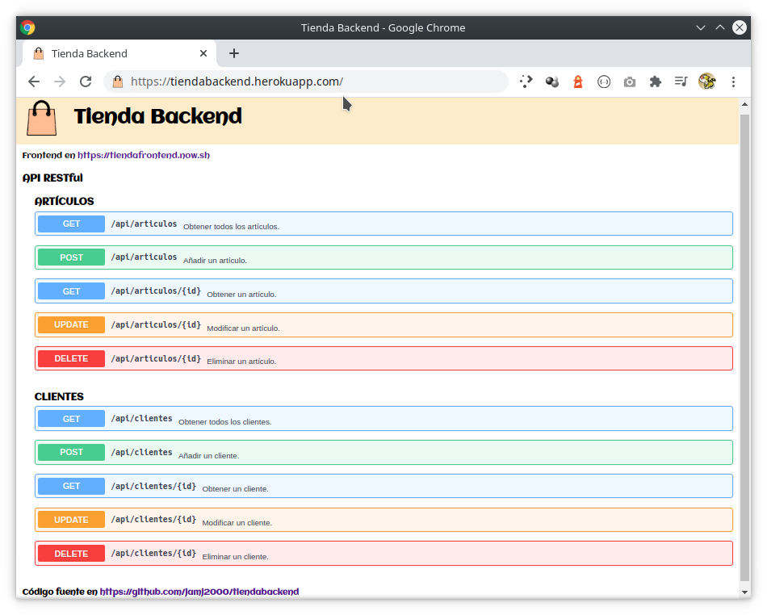
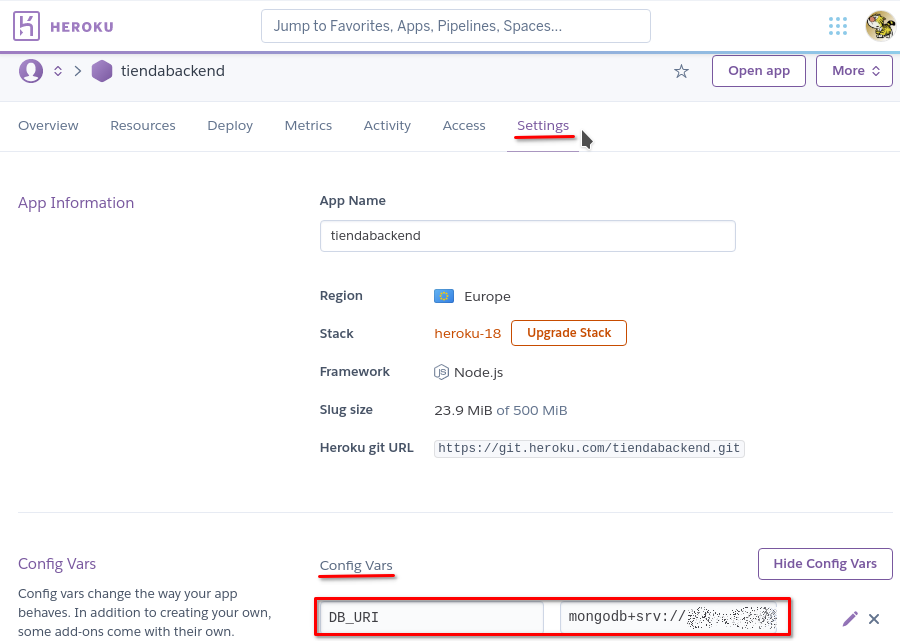

# BACKEND (con Node, Express y MongoDB)

> **ESTE MINITUTORIAL ES UNA VERSIÓN RESUMIDA DEL BACKEND DE ESTA APLICACIÓN**
> 
> Demo desplegada en
> - [Heroku](https://tiendabackend.herokuapp.com)
> - [Render](https://tiendabackend.onrender.com)
> - [Railway](https://tiendabackend.up.railway.app/)
> - [Cyclic](https://tiendabackend.cyclic.app/)
>
> A tener en cuenta:
>
> - Mucho del código que aparece en este minitutorial está simplificado con fines didácticos.
> - Para ver todo el código, revisar el código fuente de este repositorio.
> - **La parte frontend de esta aplicación puede verse en [tiendafrontend](https://github.com/jamj2000/tiendafrontend)**


## Introducción

> **Esta aplicación backend proporciona una API REST y ofrece la información en formato JSON**.
>
> Este tipo de aplicaciones tiene las siguientes ventajas:
>
> - Separación entre el backend y el frontend. 
> - Visibilidad, fiabilidad y escalabilidad. 
> - La API REST siempre es independiente del tipo de plataforma o lenguaje.
>
> REST: Representational State Transfer

Para trabajar con el entorno de ejecución Node.js y su gestor de paquetes podemos realizar la instalación desde los repositorios de Debian/Ubuntu o derivadas con:

```bash
sudo  apt  install  nodejs  npm
```

O, si deseamos una versión más actualizada, podemos recurrir al sitio oficial de Node.js:

[Página de descargas de node](https://nodejs.org/es/download/)


## Inicio de un proyecto

Para iniciar el proyecto hacemos:

```
mkdir  tiendabackend
cd     tiendabackend

npm  init  -y
```

La última sentencia nos crea un archivo **`package.json`** con la metainformación del proyecto. La opción `y` o `--yes` es para que no nos pregunte y escriba una configuración por defecto en dicho archivo. Siempre podemos editarlo más adelante y modificar la version, añadir el autor, ...


## Edición de package.json

El archivo **`package.json`** es el archivo de gestión de proyecto y dependencias. En él podremos editar el nombre del autor, la versión, el tipo de licencia, etc.

Una parte muy importante es indicar el punto de entrada. En este proyecto será el archivo **`server.js`**, que crearemos más adelante.

Para definir dicho punto de entrada, lo hacemos con la línea:

```
  "main": "server.js",
```

El archivo `package.json` tendrá una apariencia semejante a la siguiente:

```
{
  "name": "tiendabackend",
  "version": "1.0.0",
  "description": "Backend of a Fullstack webapp",
  "author": "jamj2000 at google dot com",
  "license": "GPL",
  "main": "server.js",
  "scripts": {
    "start": "node server.js",
    "test": "echo \"Error: no test specified\" && exit 1",
    "dev": "nodemon server.js"
  },
  "keywords": [
    "webapp",
    "backend",
    "fullstack"
  ]
}
```

También hemos modificado una de las líneas de `scripts`. En concreto:

```
    "dev": "nodemon server.js"
```

Esta línea indica que cuando ejecutemos `npm run dev` en el terminal, lo que se va a ejecutar en última instancia es el comando `nodemon server.js`.  

NOTA: Los scripts se ejecutan desde el terminal de texto con `npm run` *nombre_script*.

NOTA: `nodemon` es un paquete de Node.js que ejecuta node en modo monitor, es decir, está comprobando constantente cualquier cambio en nuestros archivos, y si detecta alguno, entonces vuelve a reiniciar el entorno de ejecución con los nuevos cambios. Esto es muy útil para el proceso de desarrollo de la aplicación.


## Servidor web básico

En el archivo **[`server.js`](server.js)** escribiremos el código para crear nuestro propio servidor web. En su versión mínima, solamente son necesarias 3 líneas.


```javascript
const express = require('express');

const app = express();

app.listen(3000);
```

Como nuestro backend se va a destinar a proporcionar una API REST y el intercambio de información se va a realizar en formato JSON, modificaremos el archivo anterior para que tenga la siguiente apariencia:

```javascript
const express = require('express');

const app = express();

// MIDDLEWARE
app.use(express.json());    

// SERVIDOR WEB
app.listen(3000, () => console.log("Servidor iniciado..."));
```

Hemos añadido el *midleware* de soporte de formato JSON y un callback en la última línea para que, cuando el servidor web esté iniciado, nos muestre un mensaje indicando tal circunstancia. El *midleware* es el software disponible para su ejecución entre la petición de un cliente y la respuesta del servidor.

Para probar nuestro servidor web:

```bash
npm  run  dev
```

No obstante, esto dará un error. El motivo es que necesitamos instalar los paquetes **`express`** y **`nodemon`**.

El primero se instalará como dependencia de aplicación y el segundo como dependencia de desarrollo. La diferencia entre uno y otro es que el primero es necesario para el funcionamiento de la aplicación, mientras que el segundo sólo es necesario para facilitar el proceso de desarrollo.

Deberemos ejecutar:

```bash
npm  install  express
npm  install  nodemon  -D
```

Si echamos un vistazo al archivo **`package.json`** veremos que dichos paquetes (también llamados módulos) han quedado registrados en dicho archivo:


```
{
  "name": "tiendabackend",
  "version": "1.0.0",
  "description": "Backend of a Fullstack webapp",
  "author": "jamj2000 at google dot com",
  "license": "GPL",
  "main": "server.js",
  "scripts": {
    "start": "node server.js",    
    "test": "echo \"Error: no test specified\" && exit 1",
    "dev": "nodemon server.js"
  },
  "keywords": [
    "webapp",
    "backend",
    "fullstack"
  ],
  "devDependencies": {
    "nodemon": "^2.0.2"
  },
  "dependencies": {
    "express": "^4.17.1"
  }
}
```

También veremos que se ha creado una carpeta `node_modules` con dichos módulos en su interior, además de muchos otros que son dependencias de los anteriores.

Por último, también se ha creado un archivo `package-lock.json` que contiene la versión exacta de cada dependencia. Este archivo es muy importante, puesto que indicará al servidor de producción que utilice exactamente la mismas versiones de las dependencias que usamos en nuestro entorno de desarrollo, evitando así problemas en el despligue. 

Ahora, ya podremos ejecutar `npm run dev`, y si no hay errores, podremos abrir el navegador y acceder a la url `http://localhost:3000`.


## Servidor web completo

### Sirviendo código estático

Podemos servir código estático (HTML, CSS, imágenes, ...) añadiendo el siguiente *middleware*. 

```javascript
app.use(express.static('public'));
```
Esto pondrá a disposición de todo el mundo el contenido alojado en la carpeta `public`. 

No obstante, es mejor poner una ruta absoluta. Ello se hace mediante el siguiente código:

```javascript
const path = require('path');

app.use(express.static(path.join(__dirname , 'public')));
```

En [`public/index.html`](public/index.html) pondremos una página con información acerca de la API. 




### Haciendo pública nuestra API

**IMPORTANTE:** Debemos instalar el módulo `cors`
```
npm  install  cors
```

Este módulo proporciona funcionalidad de [Cross-Origin Resource Sharing](https://es.wikipedia.org/wiki/Intercambio_de_recursos_de_origen_cruzado)

El código a añadir es:

```javascript
const cors = require('cors');

app.use(cors()); 
```

### Obteniendo información de configuración desde las variables de entorno

**IMPORTANTE:** Debemos instalar el módulo `dotenv`:
```
npm  install  dotenv
```

Utilizaremos **variables de entorno** para guardar la información de conexión a la base de datos.

Para ello usaremos un archivo `.env` y el módulo `dotenv` para leer dicho archivo.

Ejemplo de contenido del archivo `.env`:

```
PORT=3000
DB_URI=mongodb://localhost:27017/basedatos
```

Código a añadir al servidor web:

```javascript
require('dotenv').config();

const PORT   = process.env.PORT || 3000;
const DB_URI = process.env.DB_URI;
```

Si la variable `PORT` no está definida en el archivo `.env`, entonces se utiliza el valor 3000. En nuestro caso, es mejor no definir dicha variable.

La variable `DB_URI` debe estar definida en el archivo `.env` sino la conexión a la base de datos fallará. Dicha variable contiene la URL de la base de datos. Consulta más abajo, en el apartado [Base de datos](https://github.com/jamj2000/tiendabackend#base-de-datos).


### Conectando a una base de datos

**IMPORTANTE:** Debemos instalar el módulo `mongoose`
```
npm  install  mongoose
```

Para conectar a una base de datos MongoDB usaremos el módulo `mongoose`.

```javascript
const mongoose = require('mongoose');

// CONEXIÓN A BASE DE DATOS
mongoose.connect(DB_URI, { useNewUrlParser: true, useUnifiedTopology: true })
    .then(db => console.log("Conexión a BD correcta"))
    .catch(error => console.log("Error al conectarse a la BD" + error));
```

### Indicando el archivo que contiene las rutas

Lo hacemos con el siguiente código:

```javascript
const apiRoutes = require('./routes');

app.use('/api', apiRoutes);
```

Todo el código fuente del servidor está disponible en el archivo **[`server.js`](server.js)**.


## Rutas

Este backend proporpociona una **API Rest** con los siguientes **end-points**:

```
(GET)    /api/clientes         (Lista    todos los clientes)
(POST)   /api/clientes         (Crea     cliente)
(GET)    /api/clientes/:id     (Lista    cliente :id)
(PUT)    /api/clientes/:id     (Modifica cliente :id)
(DELETE) /api/clientes/:id     (Elimina  cliente :id)

(GET)    /api/articulos        (Lista    todos los artículos)
(POST)   /api/articulos        (Crea     artículo)
(GET)    /api/articulos/:id    (Lista    artículo :id)
(PUT)    /api/articulos/:id    (Modifica artículo :id)
(DELETE) /api/articulos/:id    (Elimina  artículo :id)
```

El código fuente usado es:

```javascript
const cors = require('cors')
const express = require("express");
const controller = require("./controllers.js");

const router = express.Router();

// --------------- API REST CRUD

router.get    ("/clientes",      cors(), controller.readClientes);   // Read All
router.get    ("/clientes/:id",  cors(), controller.readCliente);    // Read
router.delete ("/clientes/:id",  cors(), controller.deleteCliente);  // Delete
router.put    ("/clientes/:id",  cors(), controller.updateCliente);  // Update
router.post   ("/clientes",      cors(), controller.createCliente);  // Create

// ...

module.exports = router;
```
En este caso hemos habilitado mediante `cors` el acceso a cada **end-point** de nuestra **API** desde cualquier URL. 

Todo el código fuente de las rutas está disponible en el archivo **[`routes.js`](routes.js)**.


## Controladores

Los controladores son los encargados de realizar las operaciones CRUD. Para ello hacen uso de los modelos definidos.

```javascript
const { Cliente, Articulo } = require("./models.js");

exports.readClientes = (req, res) => 
    Cliente.find({}, (err, data) => {
        if (err) res.json({ error: err });
        else     res.json(data);
    });

// ...
```

Todo el código fuente de los controladores está disponible en el archivo **[`controllers.js`](controllers.js)**.

## Modelos

Tenemos 2 modelos:

- Cliente 
- Artículo

Cada uno tiene un esquema asociado que, en este caso, es bastante simple. Cada modelo tiene únicamente 2 propiedades:

```javascript
const Cliente = mongoose.model('Cliente',
  new mongoose.Schema({ nombre: String, apellidos: String })
);

const Articulo = mongoose.model('Articulo',
  new mongoose.Schema({ nombre: String, precio: Number })
);
```

Todo el código fuente de los modelos está disponible en el archivo **[`models.js`](models.js)**.

Mongoose proporciona muchos más tipos y opciones para definición de esquemas. Puedes consultar en [Tipos de esquemas en Mongoose](https://mongoosejs.com/docs/schematypes.html)


## ¿Vistas?

NO HAY. 

Esto NO es una aplicación MVC (Modelo-Vista-Controlador).  

Este **backend** proporciona una **API Rest**, por tanto no genera vistas, sino que ofrece la información en formato **JSON** para que la aplicación frontend la renderice a su gusto.


## Base de datos

Como servidor de base de datos vamos a usar MongoDB en su versión Cloud. Para ello podemos registrarnos en [MongoDB Atlas](https://www.mongodb.com/cloud/atlas) en su modalidad *Free*, que nos proporciona 512 MB de almacenamiento, más que suficiente para lo que queremos hacer.

Una vez registrados, crearemos un cluster (por defecto son de 3 máquinas), luego una base de datos y un usuario y contraseña para acceder a dicha base de datos. A dicho usuario le daremos permisos de lectura y escritura.

Una vez realizados estos pasos, conseguiremos la URL de acceso para aplicación de Node.js. Tiene un formato similar al siguiente:

`mongodb+srv://`***`usuario`***`:`***`contraseña`***`@`***`servidor`***`/`***`basedatos`***`?retryWrites=true&w=majority`

### Guardamos datos de conexión en variable de entorno

En el archivo **`.env`** (abreviatura de *environment*) pondremos las **variables de entorno**, tales con la URL de conexión a la base de datos. En él escribiremos la línea:

`DB_URI=mongodb+srv://`***`usuario`***`:`***`contraseña`***`@`***`servidor`***`/`***`basedatos`***`?retryWrites=true&w=majority`

Deberemos sustituir `usuario`, `contraseña`, `servidor` y `basedatos` por los que nos sean propios.

> Nota: 
>
> Una forma más sencilla de trabajar, al menos durante el proceso de desarrollo, es utilizar una base de datos local. 
> Aunque cuando vayamos a desplegar la aplicación en Internet deberemos recurrir a una base de datos on-line.
>
> Si utilizamos un servidor MongoDB local, la URL tendrá la forma:
>
> `mongodb://localhost:27017/`*basedatos*


## Control de versiones (Git)

Para el control de versiones se usará **git** y **[GitHub](https://github.com)**.

Seguiremos los siguientes pasos:

1. Inicializa el repositorio local:

```
git  init
```

2. Edita el archivo `.gitignore` con el siguiente contenido:

```
node_modules/
.env
```

De esta forma indicamos que la carpeta `node_modules` y el archivo `.env` no serán incluidos en el repositorio, sólo permanecerán en el directorio de trabajo. 

`node_modules` contiene las dependencias y no es aconsejable añadirlo al repositorio. Su contenido será *re-**creado*** a partir  del archivo `package-lock.json` una vez se despliegue en producción.

`.env` es el archivo que guarda las **variables de entorno**. Dicho contenido nunca debe añadirse al repositorio, puesto que puede contener información sensible, tal como URLs, usuarios, contraseñas, ... 


3. Añade todo el contenido al repositorio:

```
git  add  .
git  commit  -m "Añadido contenido"
```

4. Crea un repositorio totalmente vacío en GitHub.

Una vez hecho, copia la URL de dicho repositorio.

5. Añade el vínculo al repositorio remoto de GitHub creado previamente.

`git  remote  add  origin  https://github.com/` *usuario* `/` *repositorio.git*

Sustituye *usuario* y *repositorio.git* por tu usuario y tu repositorio. 


6. Sube el contenido al repositorio remoto de Github.

```
git  push  -u  origin master
```


## Despliegue


### Despliegue en Heroku


Para el despligue usaremos **[Heroku](https://www.heroku.com/)**.

Seguiremos los siguientes pasos:

1. Si no tienes cuenta en Heroku, crea una.

Para ello, visita **[Heroku](https://www.heroku.com/)** y date de alta en el plan *Free*.

2. Instala la herramienta `heroku-cli`. En [este enlace](https://devcenter.heroku.com/articles/heroku-cli) tienes la información necesaria.

3. Inicia sesión en el terminal.

```
heroku  login  --interactive
```

4. Crea una nueva aplicación.

`heroku  apps:create` *nombre_aplicación*  

Esta operación, además de crear la aplicación, reserva un repositorio git para su alojamiento.

> Nota: Sustituye *nombre_aplicación* por el valor que desees. 
>
> Ten en cuenta que muchos nombres de aplicación pueden estar ya cogidos, sobre todo si son nombres sencillos o habituales.

5. Añade el vínculo al repositorio remoto de Heroku creado previamente.

`git  remote  add  heroku  https://git.heroku.com/` *nombre_aplicación.git*

> Nota: Sustituye *nombre_aplicación* por el nombre de tu aplicación. 

6. Despliega el contenido en Heroku.

```
git  push  heroku  master
```

7. Comprueba su funcionamiento.

```
heroku  open
```

### A tener en cuenta

Puesto que el archivo `.env` no se debe subir al sistema de control de versiones, en Heroku debemos declarar las variables de entorno desde la interfaz web o desde el CLI.

En concreto, en esta aplicación debemos configurar la variable DB_URI con la URI de conexión a la base de datos.

**Desde la interfaz web**



**Desde CLI**

```bash
heroku login -i
heroku config:set DB_URI=mongodb+srv://...  -a tiendabackend
```

Para ver las variables configuradas, ejecutamos:

```bash
heroku config -a tiendabackend
```

> NOTA: Si deseamos eliminar una variable, lo hacemos con
>
> `heroku config:unset NOMBRE_VARIABLE -a tiendabackend`

> NOTA: Sustituye *tiendabackend* por el nombre de tu aplicación.


### Despliegue en Render (render.com)

Pasos a seguir:

- Acceder mediante credenciales Github.
- Conceder permisos.
- Buscar repositorio de Github a desplegar.
- Añadir las variables de entorno necesarias. En este caso la variable DB_URI.
- Configurar el nombre de aplicación y dominio.


### Despliegue en Railway (railway.app)


### Despliegue en Cyclic (cyclic.sh)

